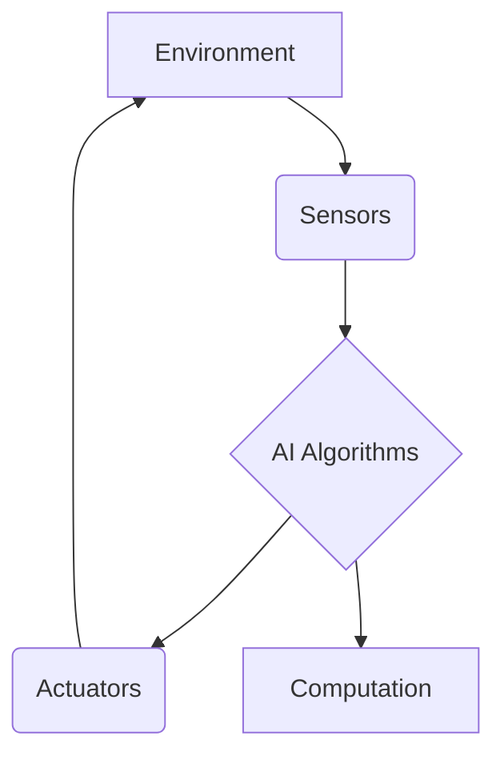

# Chapter 1: Introduction to Physical AI

Physical AI is an emerging field that combines artificial intelligence with robotic systems, allowing machines to perceive, understand, and interact with the physical world. Unlike traditional AI, which often operates within digital confines, Physical AI empowers robots to perform tasks in real-world environments, requiring them to handle uncertainty, adapt to changing conditions, and make decisions based on sensory input. This introductory chapter will lay the groundwork for understanding what Physical AI entails, its historical context, and its profound implications for the future.

## The Essence of Physical AI

At its core, Physical AI is about embodiment. It’s the idea that intelligence is not merely a computational process but is deeply intertwined with a physical body and its interactions with the environment. This perspective, often championed in fields like embodied cognition, suggests that many aspects of intelligence—such as perception, motor control, and even higher-level reasoning—are shaped by the physical form and sensory experiences of an agent. For robots, this means moving beyond simple pre-programmed actions to genuine autonomy, where they can learn and evolve through physical interaction.

### Key Components of Physical AI

Physical AI systems typically integrate several key components:

*   **Sensors**: To perceive the environment (e.g., cameras, lidar, force sensors).
*   **Actuators**: To interact with the environment (e.g., motors, grippers).
*   **Computation**: To process sensory data and make decisions (e.g., embedded systems, cloud computing).
*   **AI Algorithms**: To enable learning, reasoning, and adaptation (e.g., machine learning, deep learning, reinforcement learning).

Here’s a simple Mermaid diagram illustrating these components:



## Historical Context and Evolution

The dream of intelligent machines interacting with the physical world is as old as artificial intelligence itself. Early robotics, dating back to the mid-20th century, focused on industrial automation—robots performing repetitive tasks in structured environments. These systems, while impressive, lacked true intelligence and adaptability.

### From Industrial Robots to Autonomous Agents

The evolution of AI and computing power in the late 20th and early 21st centuries paved the way for more sophisticated robotic systems. The development of advanced sensors, powerful microcontrollers, and innovative algorithms in areas like computer vision and machine learning allowed robots to perceive their surroundings with greater fidelity and make more complex decisions. The rise of open-source robotics frameworks like ROS (Robot Operating System) further democratized access to advanced robotic capabilities, fostering a collaborative ecosystem.

### The AI Revolution and Embodied Intelligence

Recent breakthroughs in deep learning and reinforcement learning have been transformative. Robots can now learn complex motor skills through trial and error, navigate intricate environments, and even engage in rudimentary forms of human-robot interaction. The focus has shifted from merely controlling a robot to enabling it to learn and reason about its physical existence. This includes developing models that understand not just what an object is, but also how it can be manipulated, its physical properties, and its relationship to other objects.

## Why Physical AI Matters

Physical AI holds immense promise across various sectors:

*   **Healthcare**: Assisting in surgeries, elderly care, and rehabilitation.
*   **Logistics and Manufacturing**: Autonomous warehouses, flexible production lines.
*   **Exploration**: Drones and rovers for dangerous or inaccessible environments.
*   **Service Robotics**: Domestic robots, public service robots.

It’s also crucial for advancing our fundamental understanding of intelligence. By building and observing intelligent physical agents, we gain insights into the nature of learning, perception, and consciousness itself.

## Example: A Simple ROS 2 Node for Motor Control

Let’s look at a basic example of how Physical AI concepts are implemented in practice using ROS 2, a popular robotics framework. This Python code snippet demonstrates a simple ROS 2 node that publishes motor commands.

```python
# 01_simple_motor_node.py

import rclpy
from rclpy.node import Node
from std_msgs.msg import Float32

class SimpleMotorPublisher(Node):

    def __init__(self):
        super().__init__('simple_motor_publisher')
        self.publisher_ = self.create_publisher(Float32, 'motor_speed', 10)
        timer_period = 0.5  # seconds
        self.timer = self.create_timer(timer_period, self.timer_callback)
        self.speed = 0.0
        self.direction = 1  # 1 for increasing, -1 for decreasing
        self.get_logger().info('Motor Speed Publisher Node started.')

    def timer_callback(self):
        msg = Float32()
        msg.data = self.speed
        self.publisher_.publish(msg)
        self.get_logger().info(f'Publishing motor speed: {msg.data:.2f}')

        # Update speed
        self.speed += self.direction * 0.1
        if self.speed >= 1.0 or self.speed <= -1.0:
            self.direction *= -1 # Reverse direction

def main(args=None):
    rclpy.init(args=args)
    simple_motor_publisher = SimpleMotorPublisher()
    rclpy.spin(simple_motor_publisher)
    simple_motor_publisher.destroy_node()
    rclpy.shutdown()

if __name__ == '__main__':
    main()
```

To run this code:
1.  Save it as `01_simple_motor_node.py`.
2.  Ensure you have ROS 2 installed and sourced.
3.  Run the node:
    ```bash
    python 01_simple_motor_node.py
    ```
4.  You can observe the published messages using:
    ```bash
    ros2 topic echo /motor_speed
    ```

This simple example illustrates the fundamental concept of a robot publishing commands to its actuators, a basic building block of Physical AI systems.

## Key Takeaways

*   **Physical AI** integrates AI with robotics to enable machines to interact with the physical world.
*   It emphasizes **embodiment**, where intelligence is shaped by physical interaction and sensory experience.
*   Key components include **sensors, actuators, computation, and AI algorithms**.
*   The field has evolved from industrial automation to **autonomous, learning agents** driven by breakthroughs in deep learning and ROS frameworks.
*   Physical AI holds promise in **healthcare, logistics, exploration**, and contributes to understanding intelligence.

## Practice Assignment

1.  **Modify Motor Node**: Adjust the `01_simple_motor_node.py` script to make the motor speed oscillate between 0.2 and 0.8 instead of -1.0 and 1.0. Explain how you achieved this change.
2.  **Research**: Explore one real-world application of Physical AI (e.g., surgical robots, autonomous drones, warehouse robots). Describe the specific problem it solves, the types of sensors and actuators it uses, and the role of AI in its operation. Write a short summary (200-300 words).
3.  **Mermaid Diagram**: Create a Mermaid diagram illustrating the basic workflow of an autonomous drone from sensing its environment to performing an action (e.g., object detection → path planning → navigation).