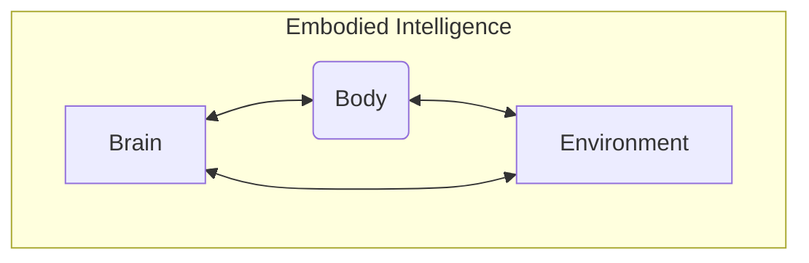

# Chapter 2: Embodied Intelligence and Humanoids

Building upon our introduction to Physical AI, this chapter delves deeper into the concept of embodied intelligence and its ultimate manifestation: humanoid robots. Embodied intelligence posits that an agent's physical body, its sensory-motor capabilities, and its interactions within the environment are not just incidental to, but fundamentally constitutive of its intelligence. Humanoid robots, with their human-like form and capabilities, serve as a compelling platform to explore these ideas, offering unique challenges and opportunities in the quest for truly intelligent machines.

## Understanding Embodied Intelligence

Traditional AI often treated intelligence as a disembodied process, focused on abstract reasoning, symbolic manipulation, and pattern recognition. However, decades of research in cognitive science and robotics have highlighted the limitations of this view. Embodied intelligence argues that intelligence arises from the dynamic interplay between a brain, a body, and the environment. For a robot, this means its ability to perceive, learn, and act is deeply influenced by its physical structure—how many joints it has, its weight distribution, its sensing modalities, and even its material properties.

### The Body as Part of the Brain

Consider how humans learn. We don't just process information; we interact with the world. A child learns about gravity by dropping objects, about textures by touching, and about space by moving through it. These physical experiences provide a rich, continuous stream of data that shapes our cognitive abilities. For robots, embodiment offers:

*   **Grounding**: Connecting abstract concepts to real-world sensory data.
*   **Physical Interaction**: The ability to manipulate objects, navigate terrain, and engage with humans.
*   **Efficient Computation**: The body can offload some computational burden; for example, a spring in a leg can store and release energy, simplifying motor control.



## The Rise of Humanoid Robots

Humanoid robots are designed to mimic the human form and, to varying degrees, human capabilities. This design choice is not merely aesthetic; it's driven by the desire for robots that can operate in human-centric environments, use human tools, and interact naturally with people. From early walking machines to advanced bipedal robots like Boston Dynamics' Atlas, humanoids have pushed the boundaries of mechanical design, control theory, and AI.

### Challenges in Humanoid Robotics

Developing humanoids presents immense challenges:

*   **Balance and Locomotion**: Bipedal walking is inherently unstable and requires complex control algorithms to maintain balance, especially on uneven terrain.
*   **Dexterity and Manipulation**: Human hands are incredibly versatile. Replicating fine motor skills and grasping diverse objects remains a significant hurdle.
*   **Power and Energy**: Moving a human-sized robot efficiently and for extended periods requires sophisticated power systems.
*   **Safety**: Operating complex, powerful machines in proximity to humans demands robust safety protocols.

## Humanoid Robotics and ROS 2

ROS 2 (Robot Operating System 2) plays a crucial role in the development of modern humanoid robots. Its modular, distributed architecture is well-suited for integrating the myriad sensors, actuators, and software components that make up a humanoid system. ROS 2 enables developers to:

*   **Manage Sensor Data**: Process camera feeds, lidar scans, IMU data.
*   **Control Actuators**: Send commands to motors, adjust joint positions.
*   **Coordinate Behaviors**: Orchestrate complex movements like walking, grasping, or reacting to stimuli.
*   **Facilitate Communication**: Allow different software modules to exchange information seamlessly.

## Example: ROS 2 Node for Bipedal Balance (Conceptual)

While full bipedal balance is exceptionally complex, we can illustrate a conceptual ROS 2 node that might form part of a larger balance control system. This Python example shows a node subscribing to IMU (Inertial Measurement Unit) data and publishing a corrective action. In a real system, this would feed into a low-level controller.

```python
# 02_bipedal_balance_node.py

import rclpy
from rclpy.node import Node
from sensor_msgs.msg import Imu
from std_msgs.msg import Float32

class BipedalBalanceController(Node):

    def __init__(self):
        super().__init__('bipedal_balance_controller')
        self.subscription = self.create_subscription(
            Imu,
            'imu/data',
            self.imu_callback,
            10)
        self.subscription  # prevent unused variable warning
        self.publisher_ = self.create_publisher(Float32, 'balance_correction', 10)
        self.get_logger().info('Bipedal Balance Controller Node started.')

    def imu_callback(self, msg):
        # In a real scenario, we'd use quaternion data to calculate pitch and roll
        # For simplicity, let's imagine we're getting an 'angle' from IMU here
        # This is a highly simplified representation for illustrative purposes

        # Example: simplified pitch from angular velocity z
        current_pitch_rate = msg.angular_velocity.z

        # Simple P-controller concept for balance
        # Target pitch rate is 0 (standing still)
        error = 0.0 - current_pitch_rate

        # Proportional gain (tuned experimentally)
        kp = 0.5

        # Calculate correction (e.g., lean forward/backward)
        correction = kp * error

        response_msg = Float32()
        response_msg.data = correction
        self.publisher_.publish(response_msg)
        self.get_logger().info(f'Received IMU (angular_velocity.z: {current_pitch_rate:.2f}), Publishing correction: {correction:.2f}')

def main(args=None):
    rclpy.init(args=args)
    bipedal_balance_controller = BipedalBalanceController()
    rclpy.spin(bipedal_balance_controller)
    bipedal_balance_controller.destroy_node()
    rclpy.shutdown()

if __name__ == '__main__':
    main()
```

To run this conceptual code:
1.  Save it as `02_bipedal_balance_node.py`.
2.  You would need an IMU publisher node (e.g., `ros2 run imu_sensor imu_publisher`) to publish on `/imu/data`.
3.  Run the controller node:
    ```bash
    python 02_bipedal_balance_node.py
    ```
4.  Observe corrections:
    ```bash
    ros2 topic echo /balance_correction
    ```

This abstract example highlights how ROS 2 nodes interact with sensory data to inform control actions, a critical aspect of embodied intelligence in humanoids.

## Key Takeaways

*   **Embodied intelligence** emphasizes the inseparable link between an agent's body, senses, and intelligence.
*   **Humanoid robots** serve as a challenging and promising platform for embodied AI due to their human-like form and interaction potential.
*   Key challenges include **balance, dexterity, power, and safety**.
*   **ROS 2** provides the modular framework for integrating complex humanoid components like sensors, actuators, and control algorithms.
*   The physical body can **offload computation** and provides **grounding** for abstract concepts.

## Practice Assignment

1.  **Refine Balance Node**: Enhance the `BipedalBalanceController` node to also consider `msg.orientation.x` and `msg.orientation.y` (roll and pitch from quaternion) to calculate a more comprehensive balance correction. (Hint: You might need a simple quaternion-to-Euler conversion for easy understanding, though real systems often work directly with quaternions). Explain your changes.
2.  **Comparative Analysis**: Research two different humanoid robots (e.g., ASIMO, Atlas, Digit, Nao). Compare their physical design, locomotion methods, and stated AI capabilities. Discuss which aspects of embodied intelligence each robot particularly excels at or struggles with. (200-300 words).
3.  **Mermaid Diagram**: Create a Mermaid diagram illustrating the flow of a humanoid robot picking up an object, from visual perception to grasping and lifting. Consider sensor input, AI processing, and actuator commands.