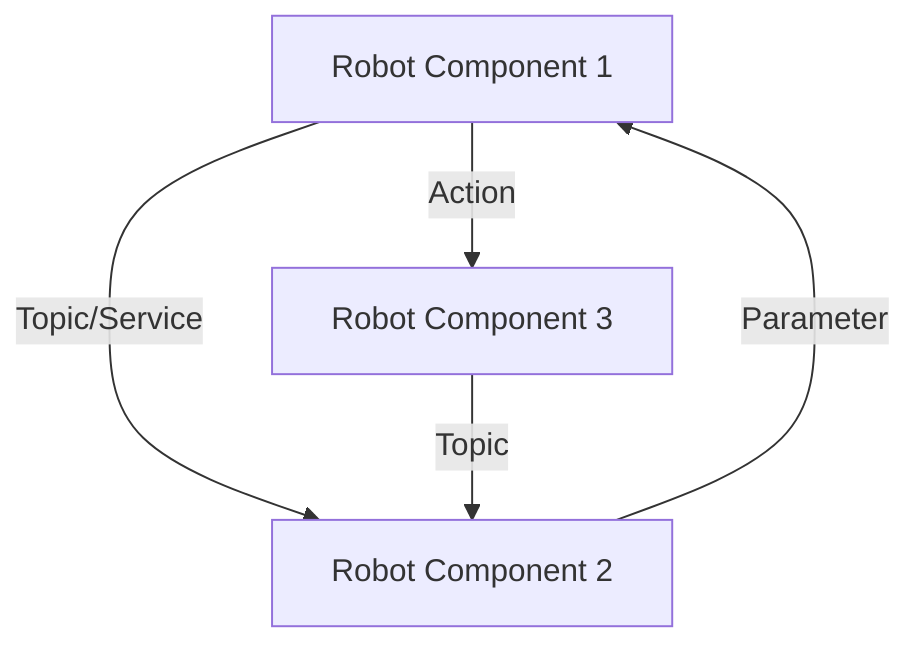

# Chapter 3: ROS 2 - The Robotic Nervous System

## The Foundation of Modern Robotics

ROS 2 (Robot Operating System 2) is a flexible framework for writing robot software. It's not an operating system in the traditional sense, but rather a collection of tools, libraries, and conventions that aim to simplify the task of creating complex and robust robot applications. ROS 2 enables disparate parts of a robotic system—such as sensors, actuators, navigation algorithms, and AI modules—to communicate and work together seamlessly, forming a cohesive robotic nervous system.

### Why ROS 2 for Physical AI and Humanoids?

The complexity of Physical AI and humanoid robotics demands a modular, distributed, and high-performance software architecture. ROS 2 addresses these needs by providing:

-   **Distributed Communication**: A robust communication infrastructure (DDS - Data Distribution Service) for real-time data exchange between different robot components.
-   **Modularity**: Encourages breaking down complex robot behaviors into smaller, manageable nodes that can be developed and tested independently.
-   **Language Agnostic**: Supports multiple programming languages (C++, Python, etc.), allowing developers to choose the best tool for each task.
-   **Extensive Tooling**: A rich ecosystem of tools for visualization, debugging, data logging, and simulation.
-   **Active Community**: A large and vibrant open-source community contributing new features, drivers, and packages.


*Figure 3.1: ROS 2 communication paradigm.* (Components can be nodes, hardware, etc.)

## Core Concepts of ROS 2

Understanding ROS 2 begins with grasping its fundamental concepts:

### 3.1. Nodes

A **Node** is an executable process that performs computation. Nodes are typically designed to do one thing well, encapsulating specific functionalities like reading sensor data, controlling a motor, or performing path planning. For instance, a robot might have a node for its camera, another for its lidar, and a third for its motor control.

```python
# Minimal ROS 2 Python Node Example
import rclpy
from rclpy.node import Node

class MyPublisher(Node):
    def __init__(self):
        super().__init__('my_publisher')
        self.publisher_ = self.create_publisher(String, 'topic', 10)
        timer_period = 0.5  # seconds
        self.timer = self.create_timer(timer_period, self.timer_callback)
        self.i = 0

    def timer_callback(self):
        msg = String()
        msg.data = 'Hello ROS 2: %d' % self.i
        self.publisher_.publish(msg)
        self.get_logger().info('Publishing: "%s"' % msg.data)
        self.i += 1

def main(args=None):
    rclpy.init(args=args)
    my_publisher = MyPublisher()
    rclpy.spin(my_publisher)
    my_publisher.destroy_node()
    rclpy.shutdown()

if __name__ == '__main__':
    main()
```
*Code 3.1: A simple ROS 2 Python publisher node.*

### 3.2. Topics

**Topics** are the primary means of asynchronous, many-to-many communication in ROS 2. Nodes publish messages to topics, and other nodes subscribe to those topics to receive the messages. This publish/subscribe model allows for loose coupling between components. For example, a camera node might publish images to an `/image_raw` topic, and a vision processing node might subscribe to it.

### 3.3. Services

**Services** provide a synchronous request/reply communication pattern. A client node sends a request to a service server, which performs a computation and sends back a response. Services are suitable for tasks that require an immediate answer, like querying the robot's current state or triggering a specific action that returns a result.

### 3.4. Actions

**Actions** are designed for long-running tasks with regular feedback. They extend services by providing pre-emption capabilities and continuous feedback during execution. An action client sends a goal to an action server, which then provides continuous feedback on progress and, eventually, a result. This is ideal for navigation goals (e.g., "go to kitchen") or complex manipulation tasks.

### 3.5. Parameters

**Parameters** allow nodes to expose configurable values at runtime. They can be dynamically adjusted without recompiling or restarting the node, offering flexibility for tuning robot behavior (e.g., PID gains, sensor thresholds).

### 3.6. Message Types (Msg/Srv/Action Definitions)

ROS 2 uses strongly typed messages. **Message definitions** (`.msg` files) define the data structures for topics. **Service definitions** (`.srv` files) define the request and response structure for services. **Action definitions** (`.action` files) combine goal, result, and feedback structures for actions. These ensure data consistency across the robotic system.

## Setting Up a ROS 2 Workspace

To develop with ROS 2, you'll typically set up a workspace, which is a collection of packages. Here's a basic workflow:

1.  **Create a Workspace**: Create a directory for your ROS 2 workspace.
    ```bash
    mkdir -p ~/ros2_ws/src
    cd ~/ros2_ws/src
    ```
2.  **Create a Package**: Use `ros2 pkg create` to create a new package.
    ```bash
    ros2 pkg create --build-type ament_python my_robot_controller
    ```
    Or for C++:
    ```bash
    ros2 pkg create --build-type ament_cmake my_robot_cpp_utils
    ```
3.  **Build the Workspace**: Compile your packages.
    ```bash
    cd ~/ros2_ws
    colcon build
    ```
4.  **Source the Setup File**: Make your packages visible to ROS 2.
    ```bash
    source install/setup.bash
    ```

```mermaid
graph TD
    A[Root Directory] --> B[ros2_ws]
    B --> C[src]
    C --> D[my_robot_controller (Python Package)]
    C --> E[my_robot_cpp_utils (C++ Package)]
    B --> F[build]
    B --> G[install]
    B --> H[log]
    G --> I[setup.bash (Source this!)]
```
*Figure 3.2: Typical ROS 2 workspace structure.*

## Launch Files and System Orchestration

For complex robotic systems with many nodes, manually starting each one is impractical. **Launch files** (written in Python or XML) allow you to define and orchestrate the startup of multiple nodes, set parameters, and remap topics. They are crucial for deploying a complete robotic application.

Here's a simple Python launch file example:

```python
# my_robot_launch.py
from launch import LaunchDescription
from launch_ros.actions import Node

def generate_launch_description():
    return LaunchDescription([
        Node(
            package='my_robot_controller',
            executable='my_publisher',
            name='robot_talker',
            output='screen',
            parameters=[
                {'publish_rate': 1.0}
            ]
        ),
        Node(
            package='my_robot_controller',
            executable='my_subscriber',
            name='robot_listener',
            output='screen'
        )
    ])
```
*Code 3.2: A ROS 2 Python launch file.*

To run this launch file:
```bash
ros2 launch my_robot_controller my_robot_launch.py
```

## Conclusion

ROS 2 provides the essential framework for developing advanced Physical AI and humanoid robotics applications. Its modular architecture, robust communication mechanisms, and extensive toolset empower developers to manage the inherent complexity of integrating diverse hardware and software components. Mastering ROS 2 is a fundamental step towards building intelligent robots that can effectively perceive, plan, and act in the physical world.

---

## Key Takeaways

-   ROS 2 is a modular framework for robot software development, enabling distributed communication and integration of various components.
-   Core concepts include Nodes (computational units), Topics (asynchronous data streams), Services (synchronous request/reply), Actions (long-running tasks with feedback), and Parameters (runtime configuration).
-   Message, service, and action definitions (`.msg`, `.srv`, `.action` files) define data structures for communication.
-   A ROS 2 workspace is used to organize and build robot packages.
-   Launch files orchestrate the startup of multiple nodes and set their configurations.

## Practice Assignment

1.  Create a new ROS 2 workspace and a Python package named `humanoid_comm`.
2.  Within `humanoid_comm`, create two Python nodes: a `sensor_publisher` that publishes a simple integer message to a topic `/humanoid_sensor_data` every second, and a `data_logger` that subscribes to this topic and prints the received data.
3.  Define a custom message type (`HumanoidData.msg`) for the `/humanoid_sensor_data` topic that includes an integer `id` and a string `timestamp`.
4.  Create a Python launch file to start both `sensor_publisher` and `data_logger` nodes. Run the launch file and verify communication using `ros2 topic echo /humanoid_sensor_data`.
