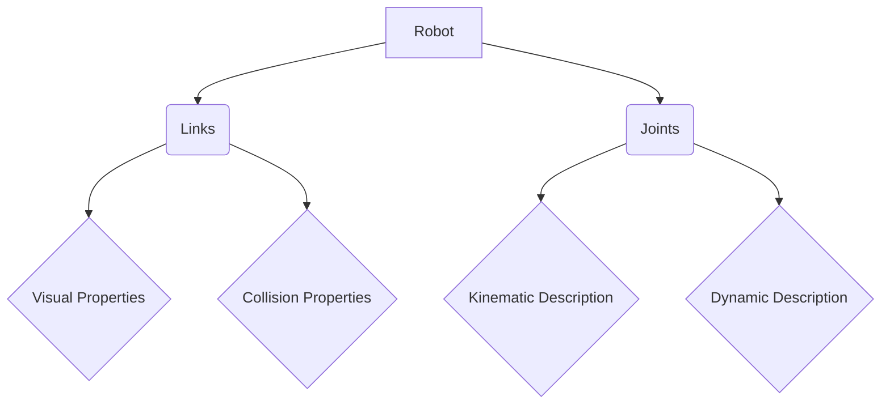

# Chapter 4: URDF and Robot Description

## Giving Robots a Digital Identity

To effectively control, simulate, and visualize a robot, its physical properties and kinematic structure must be accurately represented in a digital format. The **Unified Robot Description Format (URDF)** is an XML-based file format used in ROS 2 (and its predecessor ROS) to describe all aspects of a robot. It acts as the blueprint for your robot, defining its links (rigid bodies), joints (connections between links), and associated visual and collision properties. A well-defined URDF is foundational for almost any advanced robotic application.

### Why URDF?

-   **Standardization**: Provides a common language for describing robots, enabling interoperability between different software tools (e.g., ROS 2, Gazebo, RViz).
-   **Kinematics and Dynamics**: Encodes the robot's kinematic chain (how joints connect links) and dynamic properties (mass, inertia).
-   **Visualization**: Allows for accurate 3D rendering of the robot in simulation and visualization tools.
-   **Collision Detection**: Defines the robot's physical shape for collision checking, crucial for path planning and safe interaction.
-   **Modularity**: Can combine multiple URDF files to describe complex robots or manipulate attached tools.


*Figure 4.1: High-level structure of a URDF robot description.*

## Core Elements of URDF

URDF files are structured using XML tags. The two most fundamental elements are `link` and `joint`.

### 4.1. Links

A `<link>` element describes a rigid body segment of the robot. This could be a torso, a limb, a wheel, or even a sensor housing. Each link has:

-   **`visual`**: Defines the graphical model (e.g., a 3D mesh file like `.stl`, `.dae`) and its color, used for rendering.
-   **`collision`**: Defines the simplified geometry (e.g., box, cylinder, sphere, or mesh) used for collision detection. This is often a simplified version of the visual geometry to reduce computational cost.
-   **`inertial`**: Describes the physical properties of the link, including its mass, center of mass, and inertia tensor, essential for dynamic simulations.

Example Link Definition:
```xml
<link name="base_link">
  <visual>
    <geometry>
      <box size="0.6 0.4 0.2"/>
    </geometry>
    <material name="blue">
      <color rgba="0 0 0.8 1"/>
    </material>
  </visual>
  <collision>
    <geometry>
      <box size="0.6 0.4 0.2"/>
    </geometry>
  </collision>
  <inertial>
    <mass value="10.0"/>
    <origin xyz="0 0 0"/>
    <inertia ixx="1.0" ixy="0.0" ixz="0.0" iyy="1.0" iyz="0.0" izz="1.0"/>
  </inertial>
</link>
```
*Code 4.1: Example URDF `link` element.*

### 4.2. Joints

A `<joint>` element defines how two links are connected and how they can move relative to each other. Joints form the kinematic chain of the robot. Key attributes include:

-   **`name`**: Unique identifier for the joint.
-   **`type`**: Specifies the joint type (`revolute`, `continuous`, `prismatic`, `fixed`, `floating`, `planar`). For humanoid robots, `revolute` (rotating joints like a hinge) and `fixed` (rigid connection) are most common.
-   **`parent`**: The name of the link from which the joint originates.
-   **`child`**: The name of the link to which the joint connects.
-   **`origin`**: Defines the transform (position and orientation) of the child link relative to the parent link, where the joint resides.
-   **`axis`**: For revolute/prismatic joints, defines the axis of rotation or translation.
-   **`limit`**: For revolute/prismatic joints, defines the upper and lower position limits, velocity limits, and effort limits.

Example Joint Definition:
```xml
<joint name="base_to_arm_joint" type="revolute">
  <parent link="base_link"/>
  <child link="shoulder_link"/>
  <origin xyz="0.3 0 0.1" rpy="0 0 0"/>
  <axis xyz="0 0 1"/>
  <limit lower="-1.57" upper="1.57" velocity="1.0" effort="100.0"/>
</joint>
```
*Code 4.2: Example URDF `joint` element.*

### 4.3. Other Important Tags

-   **`material`**: Defines colors for visual elements (can be defined globally or within a link).
-   **`gazebo`**: A crucial tag for providing additional properties specifically for Gazebo simulation, such as physics parameters, sensor plugins, and motor controllers. This extends URDF beyond just kinematics.
-   **`transmission`**: Used to define how actuators (motors) are connected to joints, especially for controlling the robot in software like `ros2_control`.

## XACRO: Extending URDF for Readability and Modularity

While URDF is powerful, pure XML can become verbose and difficult to manage for complex robots like humanoids. **XACRO (XML Macros)** is an XML macro language that allows for more concise and readable robot descriptions by introducing macros, properties, and mathematical expressions. It preprocesses XACRO files into standard URDF.

Key XACRO features:

-   **Macros**: Define reusable blocks of URDF/XACRO code (e.g., a standard leg or arm segment).
-   **Properties**: Define variables (e.g., link dimensions, masses) once and reuse them throughout the file.
-   **Math Functions**: Perform calculations within the XML to derive values.
-   **Includes**: Import other XACRO files, allowing for modular robot designs.

Example XACRO usage (defining a property and a macro):
```xml
<?xml version="1.0"?>
<robot name="simple_humanoid" xmlns:xacro="http://www.ros.org/wiki/xacro">

  <xacro:property name="body_mass" value="10.0" />
  <xacro:property name="body_length" value="0.5" />

  <xacro:macro name="box_link" params="name mass x_size y_size z_size">
    <link name="${name}">
      <visual>
        <geometry>
          <box size="${x_size} ${y_size} ${z_size}"/>
        </geometry>
        <material name="green">
          <color rgba="0 0.8 0 1"/>
        </material>
      </visual>
      <collision>
        <geometry>
          <box size="${x_size} ${y_size} ${z_size}"/>
        </geometry>
      </collision>
      <inertial>
        <mass value="${mass}"/>
        <origin xyz="0 0 0"/>
        <inertia ixx="0.01" ixy="0.0" ixz="0.0" iyy="0.01" iyz="0.0" izz="0.01"/>
      </inertial>
    </link>
  </xacro:macro>

  <xacro:box_link name="torso" mass="${body_mass}" x_size="0.2" y_size="0.2" z_size="${body_length}" />

</robot>
```
*Code 4.3: A simple XACRO file demonstrating properties and macros.*

To convert an XACRO file to URDF:
```bash
ros2 run xacro xacro --inorder my_robot.xacro > my_robot.urdf
```

```mermaid
flowchart LR
    A[CAD Design (e.g., SolidWorks, Fusion 360)] --> B(Export Meshes .stl/.dae)
    B --> C[Write XACRO/URDF Description]
    C -- Preprocessing --> D[Generate Full URDF]
    D --> E[RViz Visualization]
    D --> F[Gazebo Simulation]
    D --> G[ROS 2 Control (e.g., ros2_control)]
```
*Figure 4.2: Robot description workflow.*

## Visualization with RViz

**RViz (ROS Visualization)** is a powerful 3D visualization tool in ROS 2 that uses the URDF to display the robot model, sensor data, and planning outputs. It's indispensable for debugging, monitoring, and understanding a robot's state in real-time or from logged data.

To view a URDF in RViz:

1.  Ensure you have a URDF file and `robot_state_publisher` node running (which publishes the robot's joint states based on the URDF).
2.  Launch RViz:
    ```bash
    rviz2
    ```
3.  Add a `RobotModel` display and configure its `Description Topic` to point to `/robot_description` (where `robot_state_publisher` usually publishes the URDF).

## Conclusion

URDF, extended by XACRO, provides the essential framework for digitally defining your robot. This digital twin is the foundation upon which all other robotic software components—from low-level control to high-level AI planning—are built. A meticulous and accurate robot description is crucial for successful simulation, visualization, and deployment of physical AI systems and humanoid robots.

---

## Key Takeaways

-   URDF (Unified Robot Description Format) is an XML-based language for describing robot kinematics, dynamics, visuals, and collisions.
-   Core URDF elements are `link` (rigid body) and `joint` (connection between links).
-   XACRO extends URDF with macros and properties for more readable and modular robot descriptions.
-   `robot_state_publisher` and RViz are key ROS 2 tools for visualizing URDF models.
-   A precise robot description is fundamental for simulation, control, and interaction with physical AI.

## Practice Assignment

1.  Create a simple XACRO file for a two-link robotic arm (a `base_link`, a `shoulder_link`, and an `elbow_link`) connected by two `revolute` joints. Define appropriate visual, collision, and inertial properties for each link.
2.  Use the `xacro` command to convert your XACRO file into a URDF file.
3.  Write a basic ROS 2 launch file that uses the `robot_state_publisher` node to publish your robot's URDF. You can use the `joint_state_publisher_gui` to manually control the joint angles and observe the robot in RViz.
4.  Add a simple `gazebo` extension block to one of your links in the XACRO file, defining a basic physics property (e.g., a friction value), demonstrating how URDF can be extended for simulation.
