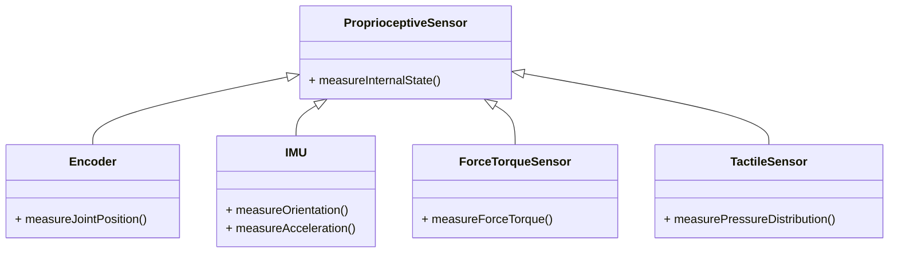
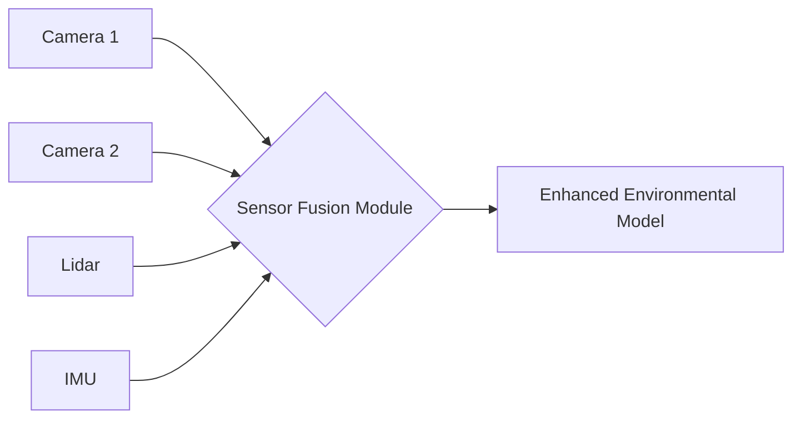

# Chapter 5: Sensors in Physical AI

## The Eyes, Ears, and Touch of a Robot

For a physical AI system to interact intelligently with the real world, it must first be able to perceive it. **Sensors** are the fundamental components that enable robots to gather information about their own state and their surrounding environment. Just as humans rely on sight, hearing, and touch, robots employ an array of sophisticated sensors to build a rich, internal representation of the world, which then informs their decision-making and actions. The choice and integration of sensors are critical for the success of any humanoid or physical AI application.

### Importance of Sensory Perception

-   **Environmental Understanding**: Sensors provide data about objects, obstacles, surfaces, and human presence.
-   **Localization and Mapping (SLAM)**: Enables robots to know where they are and to build maps of unknown environments.
-   **Object Recognition and Tracking**: Essential for manipulation, interaction, and navigation.
-   **Internal State Monitoring**: Feedback on joint angles, motor currents, battery levels, and other vital robot parameters.
-   **Safety**: Detecting potential hazards and ensuring safe operation around humans and other robots.

```mermaid
graph TD
    A[Physical World] --> B(Sensors)
    B --> C{Raw Data}
    C --> D[Perception Module (e.g., Image Processing, Point Cloud Filtering)]
    D --> E[Information (e.g., Object Position, Robot Pose)]
    E --> F[Decision Making & Control]
    F --> G[Robot Actions]
```
*Figure 5.1: Sensory data flow in a physical AI system.*

## Categories of Sensors

Sensors in robotics can be broadly categorized into proprioceptive (sensing the robot's internal state) and exteroceptive (sensing the external environment).

### 5.1. Proprioceptive Sensors

These sensors measure the robot's own state. They are crucial for control, balance, and understanding the robot's configuration.

-   **Encoders**: Measure the angular position or velocity of motor shafts and joints. Essential for precise joint control and kinematic calculations.
    -   *ROS 2 Message Type*: `sensor_msgs/msg/JointState`
-   **Inertial Measurement Units (IMUs)**: Combine accelerometers, gyroscopes, and sometimes magnetometers to measure linear acceleration, angular velocity, and orientation. Critical for maintaining balance and estimating robot pose, especially in dynamic movements like walking.
    -   *ROS 2 Message Type*: `sensor_msgs/msg/Imu`
-   **Force/Torque Sensors**: Measure forces and torques applied at specific points, such as robot wrists or feet. Provides feedback for compliant manipulation, detecting contact, and weight distribution for bipedal balance.
    -   *ROS 2 Message Type*: `geometry_msgs/msg/WrenchStamped`
-   **Tactile Sensors**: Arrays of pressure-sensitive elements providing a sense of touch, often used in grippers and fingertips for delicate object handling or surface texture recognition.
    -   *ROS 2 Message Type*: Custom messages, often based on `sensor_msgs/msg/PointCloud2` or `sensor_msgs/msg/Image` for grid-like data.


*Figure 5.2: Hierarchy of proprioceptive sensors.*

### 5.2. Exteroceptive Sensors

These sensors gather information about the external environment. They are vital for navigation, obstacle avoidance, and interaction with objects and people.

-   **Cameras**: Capture 2D image data. Widely used for object recognition, facial recognition, gesture interpretation, visual servoing, and more. RGB, grayscale, and infrared cameras are common.
    -   *ROS 2 Message Type*: `sensor_msgs/msg/Image`, `sensor_msgs/msg/CameraInfo`
-   **Depth Cameras (RGB-D)**: Provide both color images (RGB) and per-pixel depth information. Technologies like Structured Light (e.g., Intel RealSense) or Time-of-Flight (ToF) (e.g., Azure Kinect) are used. Essential for 3D perception, object pose estimation, and obstacle avoidance.
    -   *ROS 2 Message Type*: `sensor_msgs/msg/Image` (for depth), `sensor_msgs/msg/PointCloud2`
-   **Lidar (Light Detection and Ranging)**: Uses pulsed lasers to measure distances to surfaces, generating dense 3D point clouds. Excellent for accurate mapping, localization, and long-range obstacle detection.
    -   *ROS 2 Message Type*: `sensor_msgs/msg/PointCloud2`, `sensor_msgs/msg/LaserScan`
-   **Radar**: Uses radio waves to detect objects and measure their velocity and range, often robust in adverse weather conditions where lidar/cameras struggle.
    -   *ROS 2 Message Type*: Custom or `sensor_msgs/msg/PointCloud2`
-   **Microphones**: Capture audio data for speech recognition, sound localization, and understanding environmental cues, enabling conversational robotics.
    -   *ROS 2 Message Type*: `audio_common_msgs/msg/AudioData`

## Sensor Fusion: The Holistic View

No single sensor can provide a complete and perfectly reliable understanding of the environment. **Sensor fusion** is the process of combining data from multiple sensors to obtain a more accurate, robust, and comprehensive perception than any individual sensor could provide alone. For humanoids, fusing data from IMUs for pose estimation, cameras for object recognition, and depth sensors for obstacle avoidance is crucial.

Techniques for sensor fusion include:

-   **Kalman Filters / Extended Kalman Filters (EKF)**: Used for state estimation (e.g., robot pose) by combining noisy sensor measurements over time.
-   **Particle Filters**: Effective for localization in complex environments, particularly in probabilistic robotics.
-   **Deep Learning**: Neural networks can directly learn to fuse heterogeneous sensor data for tasks like object detection or scene understanding.


*Figure 5.3: Conceptual diagram of sensor fusion.*

## Sensor Data Processing in ROS 2

ROS 2 provides standard message types and tools to work with sensor data. For example, processing a camera image:

```python
# Basic ROS 2 Python image subscriber
import rclpy
from rclpy.node import Node
from sensor_msgs.msg import Image
from cv_bridge import CvBridge
import cv2

class ImageSubscriber(Node):
    def __init__(self):
        super().__init__('image_subscriber')
        self.subscription = self.create_subscription(
            Image,
            'topic_image_raw',
            self.listener_callback,
            10)
        self.subscription  # prevent unused variable warning
        self.br = CvBridge()

    def listener_callback(self, data):
        self.get_logger().info('Receiving video frame')
        current_frame = self.br.imgmsg_to_cv2(data)
        cv2.imshow("camera", current_frame)
        cv2.waitKey(1)

def main(args=None):
    rclpy.init(args=args)
    image_subscriber = ImageSubscriber()
    rclpy.spin(image_subscriber)
    image_subscriber.destroy_node()
    rclpy.shutdown()

if __name__ == '__main__':
    main()
```
*Code 5.1: A ROS 2 Python node to subscribe to and display camera images.*

This snippet demonstrates subscribing to an `Image` topic and using `cv_bridge` to convert the ROS 2 image message into an OpenCV format for processing and display.

## Conclusion

Sensors are the lifeline of any physical AI and humanoid robot, providing the essential input for intelligent behavior. A comprehensive understanding of different sensor types, their capabilities, and how to effectively fuse their data is paramount for developing robots that can robustly perceive, understand, and navigate the complexities of the real world. As AI advances, so too will the sophistication and integration of these robotic senses, leading to even more capable and autonomous systems.

---

## Key Takeaways

-   Sensors are crucial for robots to perceive their internal state (proprioceptive) and external environment (exteroceptive).
-   Proprioceptive sensors include encoders, IMUs, force/torque sensors, and tactile sensors.
-   Exteroceptive sensors include various types of cameras (RGB, depth), lidar, radar, and microphones.
-   Sensor fusion combines data from multiple sensors for a more accurate and robust environmental understanding.
-   ROS 2 provides standard message types and libraries (like `cv_bridge`) for handling sensor data.

## Practice Assignment

1.  Research and compare the principles of operation for structured light vs. Time-of-Flight (ToF) depth cameras. Discuss their respective advantages and disadvantages for humanoid robot applications.
2.  Design a sensor suite for a humanoid robot intended to assist in a smart home environment. Justify your sensor choices based on the tasks the robot would perform (e.g., fetching objects, interacting with residents, navigating cluttered rooms).
3.  Write a basic ROS 2 Python node that simulates an IMU. Publish `sensor_msgs/msg/Imu` messages to a topic `/humanoid/imu_data` at 10 Hz, with dummy (but changing) linear acceleration and angular velocity values. Visualize the output in RViz (using an IMU display if available).
