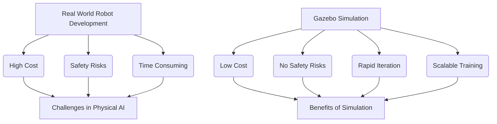

# Chapter 6: Simulation with Gazebo

## Building Virtual Worlds for Robotics

Developing, testing, and training physical AI systems, especially complex humanoids, in the real world is often expensive, time-consuming, and potentially dangerous. This is where **robot simulation** becomes indispensable. **Gazebo** is a powerful 3D robotics simulator that accurately models real-world physics, sensors, and environments, allowing developers to test their robot designs and software in a safe, repeatable, and scalable virtual setting. It provides a robust bridge between theoretical algorithms and their physical implementation.

### Why Simulation is Crucial

-   **Safety**: Test algorithms that could damage physical hardware or injure humans without real-world risks.
-   **Cost-Effectiveness**: Reduce the need for expensive physical prototypes and hardware iterations.
-   **Repeatability**: Execute the exact same scenario multiple times to debug and fine-tune algorithms.
-   **Scalability**: Run multiple simulations in parallel, accelerating data generation for AI training (e.g., reinforcement learning).
-   **Access to Ground Truth**: In simulation, you have perfect knowledge of all states (e.g., exact object positions, joint angles), which is invaluable for debugging and performance evaluation.
-   **Hardware Agnostic**: Develop and test software before physical hardware is available.


*Figure 6.1: Contrasting real-world development challenges with simulation benefits.*

## Gazebo Architecture and Components

Gazebo is built upon a modular architecture, integrating several key components:

-   **Physics Engine**: At its core, Gazebo uses high-performance physics engines (e.g., ODE, Bullet, Simbody, DART) to accurately simulate rigid body dynamics, collisions, and gravity.
-   **Rendering Engine**: Provides realistic 3D visualization of robots and environments.
-   **Sensors**: Emulates various robot sensors (cameras, lidars, IMUs, depth sensors) by generating synthetic data that mimics real-world sensor outputs.
-   **Models**: 3D representations of robots and objects, typically defined using URDF/SDF (Simulation Description Format).
-   **Worlds**: Complete environments (e.g., a factory floor, a home living room) that include models, lighting, and environmental physics.
-   **Plugins**: Extend Gazebo's functionality, allowing users to add custom physics, sensors, or control interfaces.

### SDF: The Simulation Description Format

While URDF is excellent for describing a single robot, **SDF (Simulation Description Format)** is Gazebo's native XML format for describing everything in a simulation: robots, static objects (e.g., tables, walls), lights, sensors, and even entire worlds. SDF is a superset of URDF, meaning a URDF file can generally be converted to an SDF file. It allows for more complex world descriptions and Gazebo-specific properties.

```xml
<!-- Simple SDF model example: a red box -->
<sdf version="1.8">
  <model name="red_box">
    <link name="box_link">
      <visual name="visual">
        <geometry><box><size>0.1 0.1 0.1</size></box></geometry>
        <material><diffuse>1 0 0 1</diffuse></material>
      </visual>
      <collision name="collision">
        <geometry><box><size>0.1 0.1 0.1</size></box></geometry>
      </collision>
      <inertial>
        <mass>0.1</mass>
        <inertia><ixx>0.0001</ixx><iyy>0.0001</iyy><izz>0.0001</izz></inertia>
      </inertial>
    </link>
    <static>false</static>
  </model>
</sdf>
```
*Code 6.1: A basic SDF model definition for a red box.*

## Integrating ROS 2 with Gazebo

Gazebo seamlessly integrates with ROS 2, allowing ROS 2 nodes to control simulated robots and consume synthetic sensor data. This integration is typically achieved through Gazebo ROS 2 plugins.

### 6.1. Spawning Robots in Gazebo

To bring a URDF-defined robot into a Gazebo world, you use the `spawn_entity.py` script:

```bash
ros2 run gazebo_ros spawn_entity.py -entity my_humanoid -file install/my_robot_description/share/my_robot_description/urdf/my_humanoid.urdf -x 0 -y 0 -z 1
```
This command spawns your `my_humanoid` robot model into the Gazebo simulation.

### 6.2. Gazebo ROS 2 Control Plugins

These plugins act as a bridge, allowing ROS 2 `ros2_control` (a set of packages for robot hardware abstraction) to interface with the simulated joints and actuators in Gazebo. Common plugins include:

-   `libgazebo_ros2_control.so`: The main plugin for connecting `ros2_control` to Gazebo.
-   `libgazebo_ros_force_system.so`: Applies forces to links.
-   `libgazebo_ros_diff_drive.so`: For differential drive robots.

These are configured within the robot's URDF or SDF file, often within a `<gazebo>` tag.

```xml
<!-- Example Gazebo ROS 2 control plugin in URDF -->
<gazebo>
  <plugin filename="libgazebo_ros2_control.so" name="gazebo_ros2_control">
    <parameters>$(find my_robot_controller)/config/my_robot_controllers.yaml</parameters>
  </plugin>
</gazebo>
```
*Code 6.2: URDF snippet for integrating `gazebo_ros2_control`.*

### 6.3. Sensor Plugins

Gazebo provides plugins to simulate various sensors and publish their data as ROS 2 messages:

-   `libgazebo_ros_camera.so`: Simulates a camera, publishing `sensor_msgs/msg/Image` and `sensor_msgs/msg/CameraInfo`.
-   `libgazebo_ros_imu_sensor.so`: Simulates an IMU, publishing `sensor_msgs/msg/Imu`.
-   `libgazebo_ros_ray_sensor.so`: Simulates lidar/range sensors, publishing `sensor_msgs/msg/LaserScan` or `sensor_msgs/msg/PointCloud2`.

These plugins are also typically added within `<gazebo>` tags in the URDF/SDF, attached to specific links.

## Creating a Simple Gazebo World

To simulate a robot, you need a world. A basic world can be defined in an `.world` file (an SDF file) and launched using ROS 2.

1.  **Create a `.world` file**: Define simple ground plane, lights, and maybe a few obstacles.
    ```xml
    <!-- my_simple_world.world -->
    <?xml version="1.0" ?>
    <sdf version="1.8">
      <world name="my_world">
        <light name="sun" type="directional">
          <cast_shadows>1</cast_shadows>
          <pose>0 0 10 0 -0 0</pose>
          <diffuse>0.8 0.8 0.8 1</diffuse>
          <specular>0.2 0.2 0.2 1</specular>
          <attenuation_range>1000</attenuation_range>
          <direction>-0.5 0.1 -0.9</direction>
        </light>
        <model name="ground_plane">
          <static>true</static>
          <link name="link">
            <collision name="collision">
              <geometry><plane><normal>0 0 1</normal><size>100 100</size></plane></geometry>
              <surface><friction><ode><mu>1.0</mu><mu2>1.0</mu2></ode></friction></surface>
            </collision>
            <visual name="visual">
              <geometry><plane><normal>0 0 1</normal><size>100 100</size></plane></geometry>
              <material><script><uri>file://media/materials/scripts/gazebo.material</uri><name>Gazebo/FlatGreen</name></script></material>
            </visual>
          </link>
        </model>
      </world>
    </sdf>
    ```
    *Code 6.3: A simple Gazebo world definition.*

2.  **Launch Gazebo with the world**: Use a ROS 2 launch file to start Gazebo with your custom world.
    ```python
    # launch/my_gazebo_launch.py
    from launch import LaunchDescription
    from launch.actions import IncludeLaunchDescription
    from launch.launch_description_sources import PythonLaunchDescriptionSource
    from ament_index_python.packages import get_package_share_directory
    import os

    def generate_launch_description():
        gazebo_ros_package_share_dir = get_package_share_directory('gazebo_ros')
        world_file_path = os.path.join(get_package_share_directory('my_robot_description'), 'worlds', 'my_simple_world.world')

        return LaunchDescription([
            IncludeLaunchDescription(
                PythonLaunchDescriptionSource(
                    os.path.join(gazebo_ros_package_share_dir, 'launch', 'gazebo.launch.py')
                ),
                launch_arguments={'world': world_file_path}.items()
            )
        ])
    ```
    *Code 6.4: ROS 2 launch file to start Gazebo with a custom world.*

## Conclusion

Gazebo is an indispensable tool for anyone working with physical AI and humanoid robotics. It provides a realistic, flexible, and efficient platform for developing and validating robot software, from low-level joint control to high-level AI navigation and manipulation. By mastering Gazebo, you gain the ability to iterate rapidly, reduce costs, and ensure the safety and robustness of your robotic systems before deploying them in the physical world.

---

## Key Takeaways

-   Robot simulation with Gazebo is crucial for safe, cost-effective, and repeatable development of physical AI systems.
-   Gazebo uses physics engines, rendering, and models, with SDF as its native format for describing worlds and robots.
-   ROS 2 integrates with Gazebo via plugins for robot control and synthetic sensor data publishing.
-   Launch files are used to spawn robots and load custom worlds in Gazebo.

## Practice Assignment

1.  Create a new ROS 2 package called `humanoid_simulation`.
2.  Inside `humanoid_simulation`, define a simple URDF for a humanoid torso with two revolute joints for rudimentary arm movement. Convert this URDF to SDF.
3.  Create a custom Gazebo world file (`simple_room.world`) that includes a ground plane, a light source, and a few static box obstacles.
4.  Write a ROS 2 Python launch file that starts Gazebo with your `simple_room.world` and spawns your humanoid torso model. Ensure the humanoid is visible and interacts with the obstacles if you push it around.
5.  Add a Gazebo ROS 2 camera plugin to your humanoid torso's URDF, publishing image data to a ROS 2 topic. Verify the image stream using `ros2 topic echo` or RViz.
