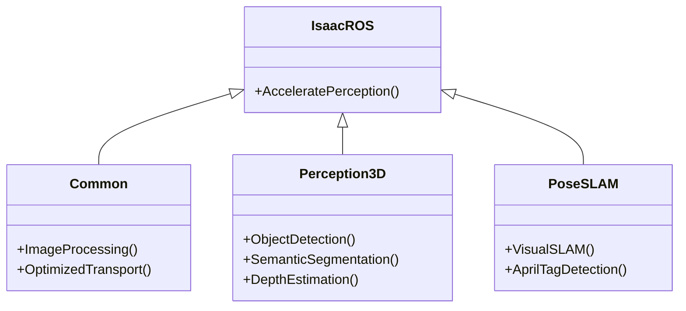

# Chapter 8: Isaac ROS and Perception

## Accelerating AI Perception in Robotics

For physical AI systems, especially humanoids, to operate autonomously, they need highly capable and efficient perception systems. **NVIDIA Isaac ROS** is a collection of hardware-accelerated ROS 2 packages that significantly boost the performance of AI-powered perception on NVIDIA computing platforms. It provides optimized components for tasks like 3D object detection, pose estimation, visual SLAM, and more, which are critical for enabling robots to understand their surroundings in real-time.

### The Need for Accelerated Perception

Traditional CPU-based perception pipelines can struggle to keep up with the high data rates of modern robotic sensors (e.g., high-resolution cameras, fast Lidars). This bottleneck limits a robot's ability to react quickly and intelligently. Isaac ROS addresses this by:

-   **GPU Acceleration**: Leveraging NVIDIA GPUs (like Jetson platforms) to parallelize complex AI computations, drastically reducing processing time.
-   **Optimized Algorithms**: Providing highly efficient implementations of perception algorithms that are tuned for NVIDIA hardware.
-   **ROS 2 Native**: Seamlessly integrating with the ROS 2 ecosystem, maintaining the modularity and flexibility of ROS.
-   **Real-time Performance**: Enabling robots to perceive and respond to dynamic environments at speeds required for safe and effective operation.

```mermaid
graph TD
    A[Raw Sensor Data (e.g., Camera, Lidar)] --> B(CPU Processing (Traditional))
    B --> C{Slow Perception Output}

    A --> D(GPU Accelerated Processing (Isaac ROS))
    D --> E{Real-time Perception Output}
    E --> F[Robotic Decision Making & Control]
```
*Figure 8.1: Comparison of traditional vs. accelerated perception pipelines.*

## Key Components of Isaac ROS

Isaac ROS offers a suite of packages, each addressing a specific aspect of robotic perception.

### 8.1. Isaac ROS Common

Provides fundamental utilities and optimized low-level components:

-   **`isaac_ros_image_proc`**: GPU-accelerated image processing (e.g., resizing, color conversion, rectification).
-   **`isaac_ros_nitros`**: NVIDIA's Transport Layer for ROS 2, optimizing message passing between GPU-accelerated nodes.

### 8.2. 3D Perception

Critical for understanding the spatial layout of the environment and identifying objects.

-   **`isaac_ros_ess` (EfficientDET)**: For 2D/3D object detection from RGB-D data, identifying objects and their bounding boxes.
-   **`isaac_ros_unet`**: Semantic segmentation using U-Net models, classifying each pixel in an image (e.g., ground, obstacle, human).
-   **`isaac_ros_stereo_msgs` / `isaac_ros_depth_image_proc`**: Stereo depth estimation and depth image processing for 3D reconstruction.
-   **`isaac_ros_pointcloud_utils`**: GPU-accelerated utilities for processing 3D point clouds (e.g., filtering, voxelization).

### 8.3. Pose Estimation & SLAM

Enabling robots to know their position and orientation and build maps.

-   **`isaac_ros_visual_slam` (VINS Fusion)**: Robust visual-inertial odometry for accurate 6-DoF pose estimation by fusing camera and IMU data. This is crucial for navigating without external positioning systems.
-   **`isaac_ros_apriltag`**: Detects AprilTags for precise object pose estimation and localization.


*Figure 8.2: Modular structure of Isaac ROS packages.*

## Integrating Isaac ROS into a Humanoid Pipeline

Consider a humanoid robot needing to pick up a specific object in a cluttered room. Its perception pipeline might involve:

1.  **Stereo Camera Data**: Captured by `sensor_msgs/msg/Image` topics.
2.  **Depth Estimation**: `isaac_ros_depth_image_proc` processes stereo images to create a depth map.
3.  **Object Detection**: `isaac_ros_ess` uses RGB-D data to detect the target object and provide a 3D bounding box.
4.  **Pose Estimation**: `isaac_ros_apriltag` (if tags are on objects) or `isaac_ros_visual_slam` for robot self-pose. If a visual language model is used, it can directly detect based on the given description.
5.  **Point Cloud Processing**: `isaac_ros_pointcloud_utils` processes point clouds for obstacle avoidance and finer object localization.

All these steps run on the GPU, providing low-latency, high-throughput perception information to the robot's control and planning systems.

```python
# Example: Launching Isaac ROS ESS (EfficientDET) node in ROS 2
from launch import LaunchDescription
from launch_ros.actions import ComposableNodeContainer
from launch_ros.descriptions import ComposableNode

def generate_launch_description():
    efficientdet_node = ComposableNode(
        package='isaac_ros_ess',
        plugin='nvidia::isaac_ros::ess::EfficientDetNode',
        name='efficientdet_node',
        parameters=[
            {'model_file_path': 'path/to/efficientdet_model.etlt'},
            {'input_rgb_topic': '/stereo_camera/left/image_raw'},
            {'input_depth_topic': '/stereo_camera/depth/image_raw'},
            {'output_detections_topic': '/isaac_ros/detections_2d_3d'},
        ],
        remappings=[
            # Define topic remappings as needed
        ]
    )

    container = ComposableNodeContainer(
        name='efficientdet_container',
        namespace='isaac_ros',
        package='rclcpp_components',
        executable='component_container',
        composable_node_descriptions=[
efficientdet_node
],
        output='screen',
    )

    return LaunchDescription([
        container
    ])
```
*Code 8.1: A ROS 2 Python launch file for an Isaac ROS EfficientDet node.*

## Conclusion

Isaac ROS is a powerful enabler for next-generation physical AI and humanoid robotics. By providing hardware-accelerated, optimized ROS 2 packages for perception, it empowers developers to build robots that can see, understand, and interact with the world with unprecedented speed and accuracy. Integrating Isaac ROS into a humanoid's perception pipeline is a critical step towards achieving truly autonomous and intelligent physical agents.

---

## Key Takeaways

-   Isaac ROS accelerates AI-powered perception on NVIDIA hardware for real-time robotic understanding.
-   It provides GPU-accelerated packages for 3D object detection, semantic segmentation, pose estimation, and visual SLAM.
-   Key components include `isaac_ros_image_proc`, `isaac_ros_nitros`, `isaac_ros_ess`, `isaac_ros_unet`, `isaac_ros_visual_slam`, and `isaac_ros_apriltag`.
-   Integration into a humanoid pipeline enables rapid processing of sensor data for tasks like object manipulation and navigation.

## Practice Assignment

1.  Research the concept of "Zero-Shot Object Detection" in the context of robotics. How could a large vision-language model combined with Isaac ROS acceleration potentially enable a humanoid robot to identify and interact with novel objects it has never seen before?
2.  Propose a simplified perception pipeline for a humanoid robot using Isaac ROS packages for the task of autonomously navigating a dynamic warehouse environment, avoiding both static shelves and moving forklifts. Outline which specific Isaac ROS packages would be most relevant for this task.
3.  (Requires Isaac ROS setup) Explore the `isaac_ros_depth_image_proc` package. Launch a simulated depth camera in Isaac Sim (publishing ROS 2 depth images) and use an Isaac ROS depth image processing node to convert the raw depth image into a point cloud. Visualize the resulting point cloud in RViz.
