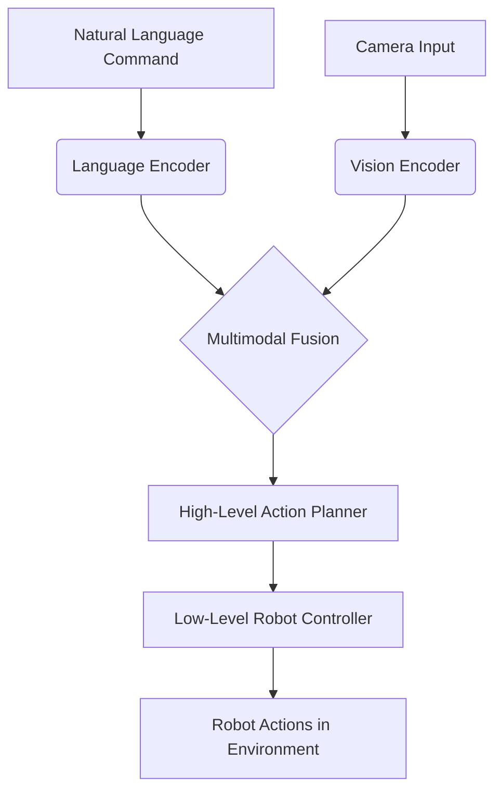
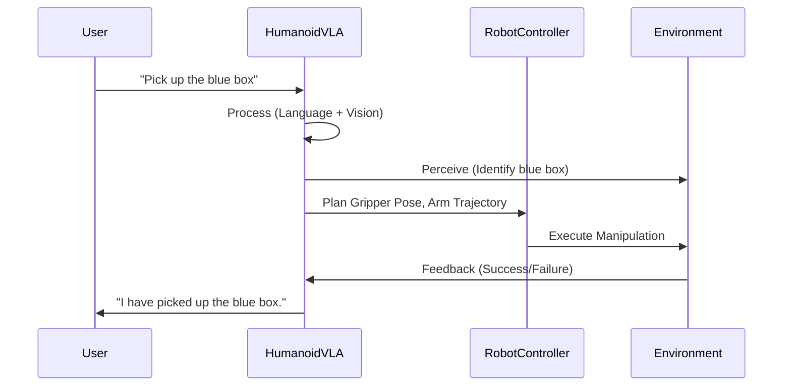

# Chapter 10: Vision-Language-Action Models

## Bridging Perception, Cognition, and Action with Language

The ability to understand and execute commands given in natural language, while interpreting visual information from the environment, represents a significant leap towards truly intelligent and intuitive humanoid robots. **Vision-Language-Action (VLA) models** are a new class of AI architectures designed to bridge the gap between disparate modalities—vision, language, and robotic actions—enabling robots to perceive, reason about, and act upon human instructions in complex, unstructured environments. These models are crucial for advancing conversational robotics and general-purpose humanoid intelligence.

### The Multimodal Challenge in Robotics

Traditional robotic systems often handle vision, language, and control as separate modules, leading to brittle performance when faced with real-world ambiguity. For example, a robot might "see" a cup but not understand a command like "please bring me the blue mug on the table." VLA models aim to integrate these modalities, allowing for a more holistic understanding:

-   **Visual Grounding**: Connecting natural language descriptions (e.g., "blue mug") to specific objects or regions in the robot's visual field.
-   **Semantic Understanding**: Interpreting the meaning of commands and translating them into a sequence of executable robotic actions.
-   **Action Generation**: Mapping high-level instructions to low-level motor commands for manipulation, navigation, and interaction.


*Figure 10.1: Conceptual architecture of a Vision-Language-Action model.*

## Foundations of VLA Models

VLA models draw heavily from advancements in large language models (LLMs) and large vision models (LVMs), extending their capabilities to embodied agents.

### 10.1. Large Language Models (LLMs)

LLMs excel at understanding and generating human language. In VLA models, they are used to:

-   **Interpret Commands**: Parse ambiguous natural language instructions into actionable intents.
-   **Reasoning**: Perform high-level reasoning about tasks, common sense, and causality.
-   **Dialogue Management**: Engage in conversational turns to clarify ambiguities or provide feedback.

### 10.2. Large Vision Models (LVMs)

LVMs are powerful image and video processing models. In VLA, they provide:

-   **Object Recognition**: Identify a vast array of objects in the scene.
-   **Scene Understanding**: Analyze the context, relationships between objects, and environmental semantics.
-   **Visual Question Answering (VQA)**: Answer questions about the visual content.

### 10.3. Multimodal Fusion

The core of VLA models lies in effectively combining the information from language and vision. Techniques include:

-   **Cross-Attention Mechanisms**: Allowing the vision encoder to focus on parts of an image relevant to a language query, and vice-versa.
-   **Shared Latent Spaces**: Mapping visual and linguistic features into a common embedding space where their relationships can be learned.
-   **Transformer Architectures**: Adapting transformer networks to handle multimodal inputs, leveraging their success in both NLP and vision.

## From Language to Robot Action

The most challenging aspect of VLA models for robotics is translating abstract linguistic and visual understanding into concrete, physical actions.

### 10.4. Action Space and Representation

Robotic actions can be represented at various levels of abstraction:

-   **High-Level Actions**: Symbolic commands like `pick_up(object, location)` or `go_to(room)`. These require further decomposition.
-   **Low-Level Actions**: Direct motor commands (joint velocities, torques, end-effector poses) that the robot can execute. These are often continuous and high-dimensional.

VLA models often output either high-level action sequences that are then fed into a traditional robot planner, or directly generate low-level control policies through reinforcement learning or imitation learning.

### 10.5. Learning Paradigms

-   **Reinforcement Learning from Human Feedback (RLHF)**: Humans provide feedback on robot actions, guiding the model to learn desired behaviors.
-   **Imitation Learning from Demonstrations**: Robots learn by observing human teleoperation or pre-recorded expert trajectories, often using paired video/language commands.
-   **Generative AI for Actions**: Using generative models to synthesize action plans or trajectories that fulfill a given multimodal prompt.

```python
# Conceptual Python snippet: VLA Model inferring action
# This is highly abstract, as real VLA models are complex neural networks

class VLAModel:
    def __init__(self, language_encoder, vision_encoder, action_decoder):
        self.lang_enc = language_encoder
        self.vis_enc = vision_encoder
        self.action_dec = action_decoder

    def infer_action(self, text_command, image_data):
        # 1. Encode language and vision
        lang_features = self.lang_enc.encode(text_command)
        vis_features = self.vis_enc.encode(image_data)

        # 2. Fuse features (e.g., concatenate, cross-attention)
        fused_features = self.fuse(lang_features, vis_features)

        # 3. Decode into action
        action = self.action_dec.decode(fused_features)
        return action

# Example usage (simplified)
# vla_model = VLAModel(...)
# command = "pick up the red apple"
# current_image = robot_camera.get_image()
# robot_action = vla_model.infer_action(command, current_image)
# robot_controller.execute(robot_action)
```
*Code 10.1: Highly conceptual Python representation of a VLA model's inference flow.*

## Applications in Humanoid Robotics

VLA models unlock a new level of interactivity and autonomy for humanoids.

-   **Instruction Following**: Humanoids can understand and execute complex commands like "Go to the kitchen, find the milk in the fridge, and bring it to the table."
-   **Task Automation**: Automating multi-step tasks that require visual perception and adaptable manipulation.
-   **Human-Robot Collaboration**: Enabling seamless collaboration where humans can intuitively direct robots using natural language.
-   **Exploration and Search**: Directing robots to "find something interesting in the corner" or "search for a specific tool."
-   **Personal Assistants**: Humanoid robots acting as intelligent companions, responding to verbal requests that involve physical interaction with the environment.


*Figure 10.2: Humanoid robot executing a vision-language instruction.*

## Challenges and Future Directions

Despite their promise, VLA models face several challenges:

-   **Data Scarcity**: Acquiring massive, high-quality, multimodal datasets (vision-language-action triplets) is difficult and expensive.
-   **Generalization**: VLA models often struggle to generalize to novel objects, environments, or tasks not seen during training.
-   **Robustness**: Performance can degrade significantly in cluttered scenes, poor lighting, or with ambiguous commands.
-   **Safety and Explainability**: Ensuring safe action generation and understanding the reasoning behind a robot's decisions are crucial.

Future work focuses on improving data efficiency (e.g., self-supervised learning, synthetic data), enhancing generalization capabilities (e.g., foundation models for robotics), and developing more sophisticated reasoning and planning components that can integrate with VLA models.

---

## Key Takeaways

-   Vision-Language-Action (VLA) models enable robots to understand and execute natural language commands based on visual perception.
-   They fuse capabilities from Large Language Models (LLMs) and Large Vision Models (LVMs).
-   Multimodal fusion techniques combine information from different modalities.
-   Translating abstract commands to low-level robot actions is a core challenge, often using reinforcement or imitation learning.
-   VLA models enable advanced applications like instruction following and human-robot collaboration for humanoids.
-   Challenges include data scarcity, generalization, robustness, safety, and explainability.

## Practice Assignment

1.  Imagine a VLA-powered humanoid robot in a kitchen. Provide three distinct natural language commands, each requiring a different combination of visual perception, language understanding, and physical action (e.g., finding an object, preparing a simple dish, cleaning up).
2.  Research a recent breakthrough in VLA models for robotics (e.g., Google's PaLM-E, Open AI's DALL-E/CLIP variants applied to robotics). Summarize its architecture, key contributions, and how it addresses some of the challenges mentioned in this chapter.
3.  Discuss how a VLA model could be used to improve the human-robot collaboration aspect of a humanoid robot assisting an elderly person at home. What kind of interactions would be possible, and what ethical considerations arise?
