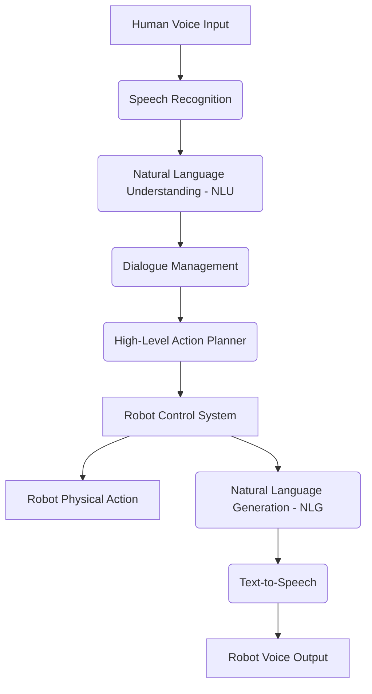
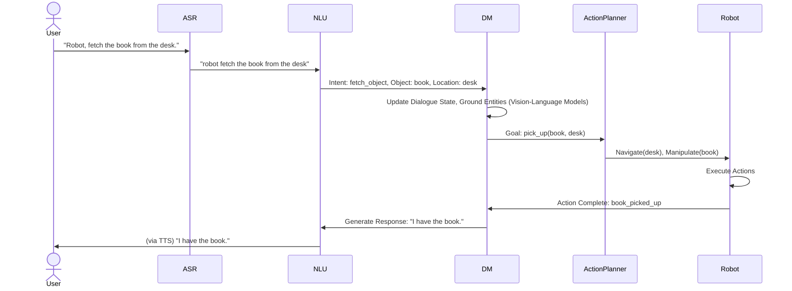

# Chapter 11: Conversational Robotics: Voice to Action

## Enabling Natural Human-Robot Communication

For humanoid robots to truly integrate into human environments, they must be able to communicate naturally and intuitively with people. **Conversational Robotics** focuses on enabling robots to understand spoken language, engage in dialogue, and translate verbal commands into physical actions. This interdisciplinary field combines advancements in speech recognition, natural language understanding (NLU), dialogue management, and robotic control to create seamless and effective human-robot interaction (HRI).

### The Importance of Voice Interface

-   **Natural Interaction**: Voice is the most intuitive form of communication for humans, eliminating the need for complex interfaces.
-   **Accessibility**: Provides an alternative interaction method for individuals with motor impairments or those who find graphical interfaces challenging.
-   **Hands-Free Operation**: Allows users to multitask while interacting with the robot.
-   **Situational Awareness**: Verbal cues can provide rich context that is difficult to convey through other means.


*Figure 11.1: End-to-end pipeline for conversational robotics.*

## Key Components of Conversational Robotics

### 11.1. Speech Recognition (Automatic Speech Recognition - ASR)

ASR systems convert spoken words into text. For robotics, this involves robust performance in noisy environments and understanding diverse accents and speech patterns. Modern ASR leverages deep learning models (e.g., Transformers, Recurrent Neural Networks).

-   **Challenges**: Background noise, multiple speakers, accents, varying speech rates, domain-specific terminology.
-   **ROS 2 Integration**: Often uses external cloud-based APIs (Google Speech-to-Text, Azure Speech) or on-device engines (e.g., Vosk, NVIDIA Riva) integrated via ROS 2 nodes.

### 11.2. Natural Language Understanding (NLU)

NLU processes the transcribed text to extract its meaning, intent, and relevant entities. This is crucial for translating human commands into machine-executable formats.

-   **Intent Recognition**: Identifying the user's goal (e.g., "navigate", "pick_up", "report_status").
-   **Entity Extraction**: Identifying key pieces of information (e.g., "blue cup", "kitchen", "table").
-   **Dialogue Act Classification**: Understanding the communicative function of an utterance (e.g., question, command, confirmation).

### 11.3. Dialogue Management (DM)

DM manages the flow of the conversation, keeping track of context, resolving ambiguities, and determining the robot's next response or action. This often involves state machines or more advanced neural dialogue models.

-   **Context Tracking**: Remembering previous turns and relevant information.
-   **Disambiguation**: Asking clarifying questions when commands are vague (e.g., "Which cup do you mean?").
-   **Turn-Taking**: Ensuring natural conversational flow.

```python
# Conceptual Python snippet: NLU and Dialogue State Update
# In a real system, this would involve complex ML models and state management

class DialogueManager:
    def __init__(self):
        self.context = {}
        self.robot_state = {'location': 'living_room', 'holding': None}

    def process_utterance(self, text):
        intent = self.nlu_model.get_intent(text)
        entities = self.nlu_model.get_entities(text)

        response_text = ""
        action_command = None

        if intent == "navigate_to":
            target_location = entities.get('location')
            if target_location:
                action_command = f"navigate({target_location})"
                response_text = f"Navigating to {target_location}."
                self.robot_state['location'] = target_location # Update state
            else:
                response_text = "Where would you like me to go?"
        elif intent == "pickup_object":
            target_object = entities.get('object')
            if target_object:
                action_command = f"pickup({target_object})"
                response_text = f"Attempting to pick up the {target_object}."
                self.robot_state['holding'] = target_object # Update state
            else:
                response_text = "What should I pick up?"
        else:
            response_text = "I'm sorry, I didn't understand that."

        return response_text, action_command

# Example usage
# dm = DialogueManager()
# text_input = "Go to the kitchen"
# response, action = dm.process_utterance(text_input)
# print(response) # "Navigating to kitchen."
# print(action)   # "navigate(kitchen)"
```
*Code 11.1: Simplified Python class for NLU and dialogue state management.*

### 11.4. Natural Language Generation (NLG) and Text-to-Speech (TTS)

NLG is the process of generating human-like text responses from structured data or dialogue states. TTS then converts this text into spoken audio, allowing the robot to speak its responses.

-   **NLG**: Can use rule-based systems or advanced generative LLMs.
-   **TTS**: Converts text to speech, often using neural networks for natural-sounding voices.

## Voice-to-Action Integration

The ultimate goal is to seamlessly integrate the conversational components with the robot's physical action capabilities. This often means mapping high-level action commands from the dialogue manager to the robot's planning and control systems.

-   **ROS 2 Actions/Services**: High-level commands (e.g., `navigate(target_location)`, `pickup(object)`) can be translated into ROS 2 action goals or service requests for the robot's motion planning and manipulation stacks.
-   **Vision-Language Grounding**: Crucial for commands involving specific objects (e.g., "pick up *that* red box"), where the NLU output must be grounded in the visual perception of the scene.


*Figure 11.2: Detailed voice-to-action sequence.*

## Challenges and Future Directions

Conversational robotics faces significant challenges:

-   **Robustness to Errors**: Cascading errors from ASR, NLU, or action failures.
-   **Common Sense Reasoning**: Robots still lack deep common sense needed for truly intelligent conversations and actions.
-   **Personalization**: Adapting to individual user's speech patterns, preferences, and social cues.
-   **Proactive Interaction**: Initiating conversations or offering help without explicit prompts.
-   **Multimodal Dialogue**: Incorporating gestures, facial expressions, and visual context into the conversation.

Future advancements will likely involve end-to-end differentiable VLA models, more powerful foundation models for HRI, and continuous learning from human interaction to improve conversational fluency and physical competence.

---

## Key Takeaways

-   Conversational Robotics enables robots to interact naturally using spoken language, translating voice commands into physical actions.
-   Key components include Speech Recognition (ASR), Natural Language Understanding (NLU), Dialogue Management (DM), Natural Language Generation (NLG), and Text-to-Speech (TTS).
-   Voice-to-action integration maps high-level commands from NLU/DM to robot planning and control systems, often leveraging ROS 2 actions/services.
-   Vision-language grounding is crucial for commands involving specific objects in the environment.
-   Challenges include robustness, common sense reasoning, personalization, and multimodal dialogue.

## Practice Assignment

1.  Consider a humanoid robot serving as a receptionist. Design a simple dialogue flow (using conditional statements or a state machine) for a user asking the robot to "Call a taxi for me." Include steps for clarifying destination, confirming, and reporting status.
2.  Research the NVIDIA Riva SDK for conversational AI. How does Riva contribute to building on-device, low-latency conversational interfaces for robotics, and what are its key advantages over purely cloud-based solutions?
3.  (Conceptual) Outline a Python script that integrates a mock ASR output with a simple NLU component (e.g., using a dictionary for intent/entity mapping) and then prints a corresponding high-level robot action command. For instance, if input is "go to kitchen", output `ACTION: NAVIGATE, LOCATION: kitchen`.
