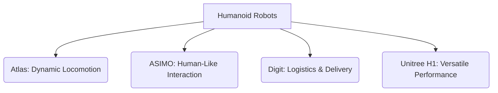

# Recommended Humanoid Robots

Humanoid robots represent the pinnacle of embodied AI, pushing the boundaries of mechanical design, control, and artificial intelligence. While these advanced machines are often expensive and complex, understanding their capabilities and design philosophies is crucial for any student of Physical AI. This guide introduces some of the most prominent and influential humanoid robots, highlighting their unique features and contributions to the field.

## Leading Humanoid Robots

### 1. Boston Dynamics Atlas

Atlas is perhaps the most famous bipedal humanoid robot, renowned for its incredible agility, balance, and dynamic movements. Developed by Boston Dynamics, Atlas is a research platform that excels in advanced locomotion, including running, jumping, and performing complex parkour maneuvers. It uses hydraulics for powerful and precise movements.

*   **Key Features**: Highly dynamic locomotion, hydraulic actuation, advanced balance control, ability to operate in complex and unstructured environments.
*   **Applications**: Primarily a research platform for pushing the limits of bipedal robotics and dynamic manipulation.
*   **Learning Value**: Demonstrates state-of-the-art in bipedal control, force control, and dynamic task execution.

### 2. Honda ASIMO

ASIMO (Advanced Step in Innovative Mobility) was a groundbreaking humanoid robot developed by Honda. While its development has concluded, ASIMO was instrumental in demonstrating stable bipedal locomotion, human-robot interaction, and performing tasks in human environments like walking stairs, running, and even conducting an orchestra. ASIMO focused on fluid, human-like motion.

*   **Key Features**: Advanced bipedal locomotion (walking, running, stair climbing), human-friendly design, extensive human-robot interaction capabilities.
*   **Applications**: Public relations, research into human-robot coexistence.
*   **Learning Value**: Historical significance in humanoid development, pioneering stable bipedalism and human interaction.

### 3. Digit by Agility Robotics

Digit is a bipedal robot designed for practical tasks, especially in logistics and last-mile delivery. It features a torso, two arms, and two legs, and is capable of walking, carrying packages, and navigating diverse terrain. Digit is designed to work alongside humans in warehouses and other dynamic environments.

*   **Key Features**: Bipedal locomotion for navigating human spaces, designed for practical manipulation and package delivery, robust and energy-efficient.
*   **Applications**: Logistics, warehouse automation, last-mile delivery.
*   **Learning Value**: Focus on commercial viability, robust navigation in semi-structured human environments, and human-robot collaboration in work settings.

### 4. Unitree H1

Unitree H1 is a more recently developed general-purpose humanoid robot known for its impressive walking speed and payload capacity. Unitree Robotics, already known for its quadruped robots, is bringing its expertise in robot dynamics to the bipedal form factor. H1 is designed to be a versatile platform for research and practical applications.

*   **Key Features**: High walking speed, impressive payload, advanced motor control, modular design for customization.
*   **Applications**: Research, education, future service applications.
*   **Learning Value**: Exploration of modern bipedal control, high-performance actuation, and versatile platform development.

## Considerations for Students

While owning a full-scale humanoid robot is often beyond a student's reach, understanding these platforms is vital. Consider the following:

*   **Simulation**: Utilize simulation environments like Gazebo and NVIDIA Isaac Sim to experiment with humanoid models (e.g., loading URDFs of simple humanoids, simulating walking algorithms).
*   **Open-source Projects**: Look for open-source humanoid robot projects or control libraries that you can study and contribute to.
*   **Small-scale Humanoids**: Some smaller, more affordable humanoids (e.g., Nao, Pepper, some DIY kits) are available for hands-on learning, though they may not match the capabilities of the leading research platforms.
*   **Research Papers**: Stay updated with the latest research on humanoid robotics to understand the ongoing challenges and breakthroughs.

## Key Takeaways

*   **Atlas** excels in dynamic locomotion and research into bipedal limits.
*   **ASIMO** pioneered stable bipedal walking and human-robot interaction.
*   **Digit** focuses on practical logistics and working in human environments.
*   **Unitree H1** is a high-performance, general-purpose humanoid platform.
*   Students can learn about humanoids through **simulation, open-source projects, and small-scale robots**.

## Practice Assignment

1.  **Humanoid Comparison Essay**: Choose two humanoid robots (from this chapter or your own research) and write a comparative essay (300-500 words) focusing on their design philosophy, key technological innovations, and their intended applications. Discuss the trade-offs in their design choices.
2.  **Simulation Exercise**: Find an open-source URDF model of a simple humanoid robot (e.g., from ROS repositories). Load this model into Gazebo (or a similar simulator) and try to make it stand or perform a basic movement using ROS 2 commands. Document your steps and observations.
3.  **Future of Humanoids**: Research and discuss what you believe will be the next major breakthrough in humanoid robotics within the next 5-10 years. Consider areas like AI integration, power systems, dexterity, or human-robot collaboration.