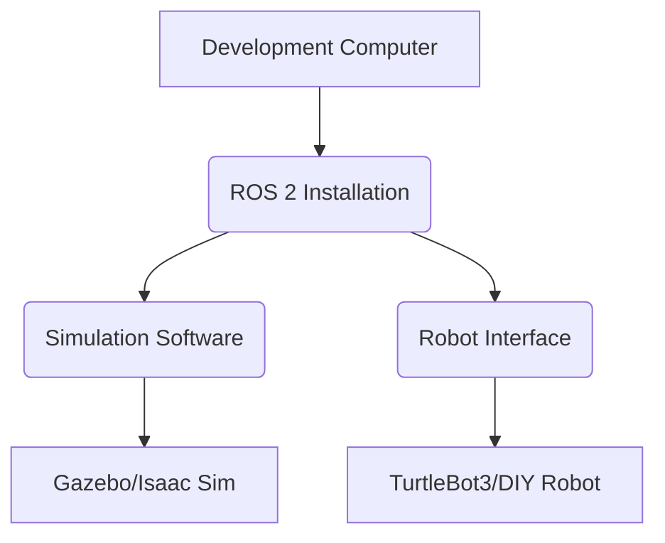

# Student Hardware Guide

Welcome to the exciting world of Physical AI and Humanoid Robotics! To get the most out of this textbook and its practical assignments, having access to certain hardware can significantly enhance your learning experience. While many concepts can be explored through simulation, hands-on interaction with physical robots or development kits provides invaluable insights.

This guide outlines recommended hardware for students, balancing cost, functionality, and learning potential. Remember, you don't need everything on this list to get started, and many universities provide access to shared robotics labs.

## Essential Components for ROS 2 Development

ROS 2 (Robot Operating System 2) is central to this course. A reliable development machine is crucial.

### 1. Development Computer

*   **Operating System**: Ubuntu 22.04 LTS (Jammy Jellyfish) is highly recommended, as it's the primary platform for ROS 2. Dual-booting or using a virtual machine (e.g., VirtualBox, VMware) is a good option if you primarily use Windows or macOS.
*   **Processor**: Intel i5/i7 (8th Gen or newer) or AMD Ryzen 5/7 (2nd Gen or newer).
*   **RAM**: 16 GB or more. Robotics simulations and AI models can be memory-intensive.
*   **Storage**: 256 GB SSD (Solid State Drive) or larger. SSDs drastically improve system responsiveness, especially when compiling large robotics projects.
*   **Graphics Card (Optional but Recommended)**: An NVIDIA GPU (GTX 1660 or better) is highly recommended if you plan to use NVIDIA Isaac Sim or other GPU-accelerated AI workloads. This will significantly speed up simulations and deep learning inference.

### 2. Basic Robotics Kit (Optional)

For hands-on experience, a basic mobile robot platform is ideal. These kits allow you to experiment with motor control, sensor integration, and basic navigation.

*   **Robotis TurtleBot3 Burger/Waffle Pi**: These are popular, well-supported ROS 2 compatible mobile robot platforms. They come with a single-board computer (like Raspberry Pi 4 or Intel Joule), sensors (LIDAR, IMU), and motors.
    *   **Pros**: Excellent ROS 2 integration, extensive documentation, good community support, ideal for learning navigation and mapping.
    *   **Cons**: Relatively expensive.
*   **DIY Robot Car Kit (e.g., based on Arduino/Raspberry Pi)**: More affordable options are available where you build a robot car chassis and integrate components like DC motors, motor drivers, ultrasonic sensors, and a Raspberry Pi for ROS 2 control.
    *   **Pros**: Cost-effective, great for learning hardware integration and basic electronics.
    *   **Cons**: Requires more effort in assembly and software setup, less out-of-the-box ROS 2 support.

## Advanced Components for Humanoid & Advanced AI

These components are for more advanced students interested in deeper exploration of humanoid robotics and Vision-Language-Action (VLA) models.

### 1. NVIDIA Jetson Development Kit

*   **NVIDIA Jetson Nano/Xavier NX/Orin Nano/AGX Orin**: These are powerful embedded systems with NVIDIA GPUs, designed for AI at the edge. They are excellent for deploying deep learning models on robots for tasks like object detection, pose estimation, and VLA model inference.
    *   **Pros**: High AI performance in a compact form factor, strong ROS 2 and Isaac ROS integration, ideal for real-time perception and AI tasks.
    *   **Cons**: Can be more challenging to set up than a Raspberry Pi, higher cost.

### 2. Robotic Manipulator (Optional)

For manipulation tasks, a small robotic arm can provide valuable experience.

*   **UFACTORY Lite 6/Magician**: Affordable, desktop-sized robotic arms that can be controlled via ROS 2. Good for learning inverse kinematics, path planning for manipulation, and simple pick-and-place tasks.
    *   **Pros**: Relatively inexpensive, good for basic manipulation concepts.
    *   **Cons**: Limited payload and reach for complex industrial tasks.

## Software Recommendations

Beyond ROS 2 itself, here are key software tools:

*   **Integrated Development Environment (IDE)**: VS Code with ROS extensions, PyCharm, or any text editor you are comfortable with.
*   **Simulation Software**: Gazebo (classic or Fortress/Garden versions) and NVIDIA Isaac Sim (requires NVIDIA GPU).
*   **Version Control**: Git (essential for managing your code and collaborating).
*   **Containerization**: Docker (useful for setting up isolated development environments and deploying ROS 2 applications).

## Important Considerations

*   **Budget**: Robotics hardware can be expensive. Prioritize based on your learning goals and budget.
*   **Community Support**: Opt for hardware with good documentation and an active community, as this will greatly assist you in troubleshooting.
*   **Safety**: Always prioritize safety when working with physical robots. Ensure you understand how to safely operate and emergency stop any robotic system.

This guide should help you make informed decisions about your hardware setup. Happy building and learning!

## Key Takeaways

*   **Development Computer**: Ubuntu, 16GB RAM, SSD, and an NVIDIA GPU are recommended for ROS 2 and AI development.
*   **Basic Robotics Kit**: TurtleBot3 is a popular ROS 2 platform; DIY kits are a cost-effective alternative for hands-on learning.
*   **Advanced AI Hardware**: NVIDIA Jetson kits provide powerful embedded GPUs for edge AI and real-time perception.
*   **Robotic Manipulators**: Desktop arms like UFACTORY Lite 6 are good for learning manipulation concepts.
*   **Software**: VS Code, Gazebo, Isaac Sim, Git, and Docker are highly recommended tools.
*   **Considerations**: Budget, community support, and safety are crucial when choosing and working with hardware.

## Practice Assignment

1.  **Hardware Research**: Identify a specific robotic project or application you are interested in (e.g., a home assistant robot, an autonomous delivery drone). Research the minimum and recommended hardware specifications required for that project. Justify your choices based on sensor needs, computational power, and budget constraints.
2.  **ROS 2 Setup Simulation**: Outline the steps you would take to set up a ROS 2 development environment on your local machine, including installing ROS 2, creating a workspace, and compiling a simple package. If you have an NVIDIA GPU, include steps for setting up CUDA and cuDNN for potential future use with Isaac ROS.
3.  **Component Comparison**: Research two different types of sensors commonly used in robotics (e.g., Lidar vs. Depth Camera, IMU vs. Encoder). Compare their advantages, disadvantages, typical applications, and how their data might be integrated into a ROS 2 system.